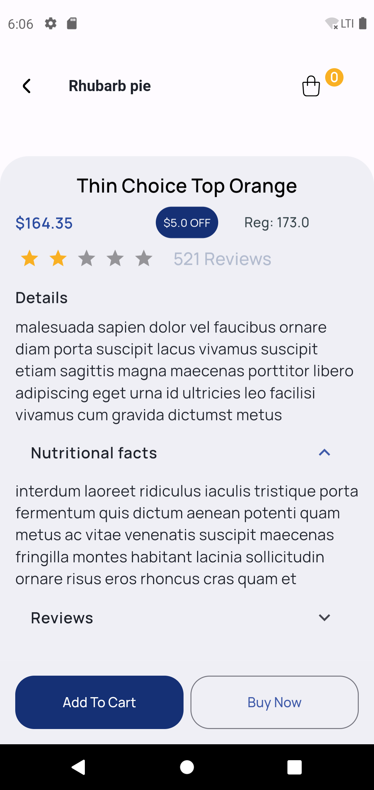

# Flutter Shopping Food App

## Overview

This Flutter application is a shopping food app designed to provide a seamless and intuitive
shopping experience. The app includes features such as product browsing, category-wise shopping,
detailed product descriptions, shopping cart management, payment processing, order tracking, and
onboarding screens.

## 📜 Table of Contents

- [✨ Features](#-features)
- [📱 App Preview](#-app-preview)
- [🎥 Demo Video](#-demo-video)
- [⚙️ Installation](#-installation)
- [🤝 Contributing](#-contributing)
- [📄 License](#-license)

## ✨ Features

1. **Onboarding**: Introduction screens to guide new users through the app's features.
2. **Product Browsing**: Users can browse products, view details, and shop by category.
3. **Shopping Cart**: Add, update, and remove items from the cart.
4. **Payment Processing**: Add and manage payment methods securely.
5. **Order Tracking**: Track the status of current and past orders.

## 📱 App Preview

<div style="display: flex; flex-wrap: wrap; gap: 50px;">


</div>

<div style="display: flex; flex-wrap: wrap; gap: 50px;">





</div>

<div style="display: flex; flex-wrap: wrap; gap: 50px;">


</div>

## 🎥 Demo Video


## ⚙️ Installation

1. **Clone the repository**:
    ```bash
    git clone https://github.com/Ahmad-Nour-Haidar/shopping-app.git
    ```

2. **Navigate to the project directory**:
    ```bash
    cd shopping-app
    ```

3. **Install dependencies**:
    ```bash
    flutter pub get
    ```

4. **Run the application**:
    ```bash
    flutter run
    ```

## 🤝 Contributing

We welcome contributions to enhance the Shopping Food App. Here’s how you can help:

1. **Fork the repository**.
2. **Create a new branch**:
    ```bash
    git checkout -b feature-branch
    ```
3. **Make your changes and commit them**:
    ```bash
    git commit -m "Description of the feature"
    ```
4. **Push to the branch**:
    ```bash
    git push origin feature-branch
    ```
5. **Create a pull request**.

Please ensure your pull request adheres to the following guidelines:

- Describe the feature or fix in detail.
- Ensure the code follows the existing style and conventions.
- Include screenshots or demos of the new feature or fix if applicable.

## 📄 License

This project is licensed under the MIT License. See the [LICENSE](LICENSE) file for details.
